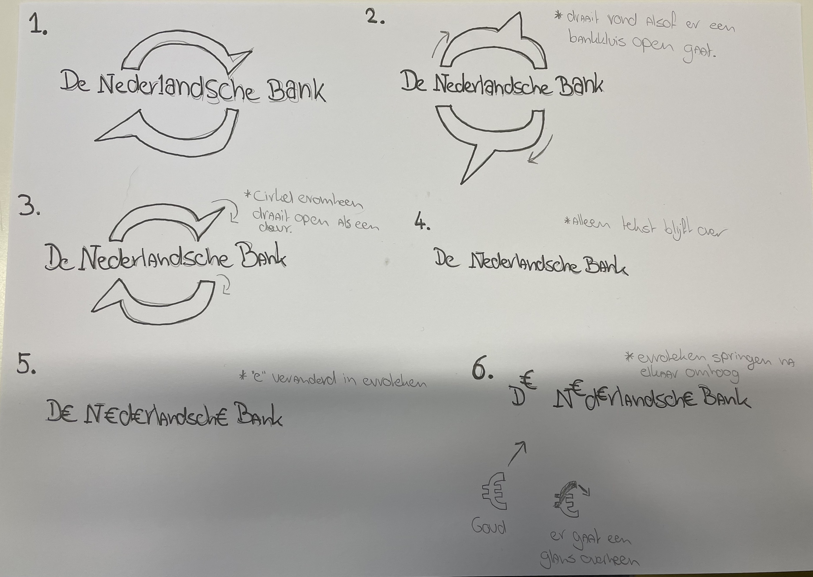
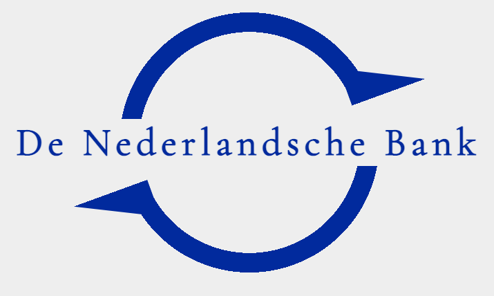
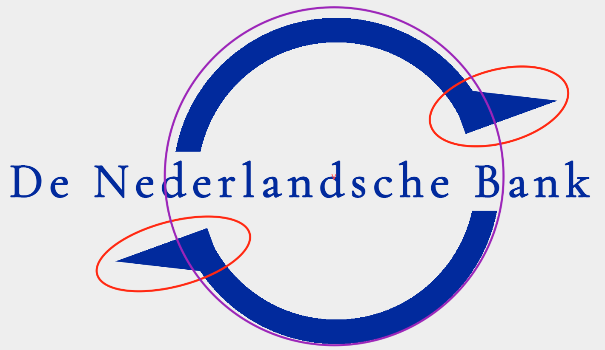
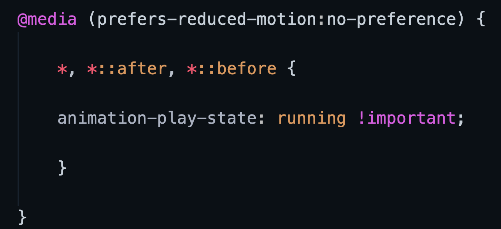
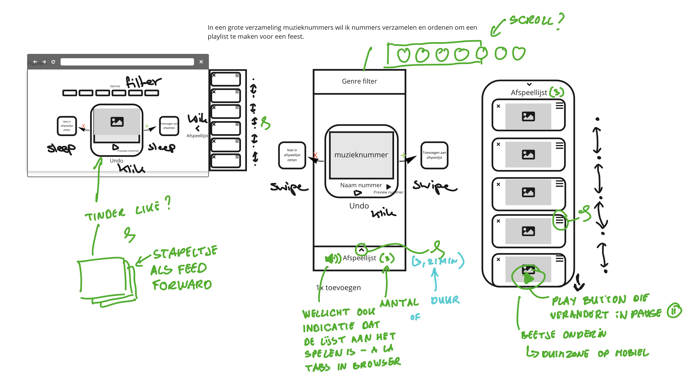
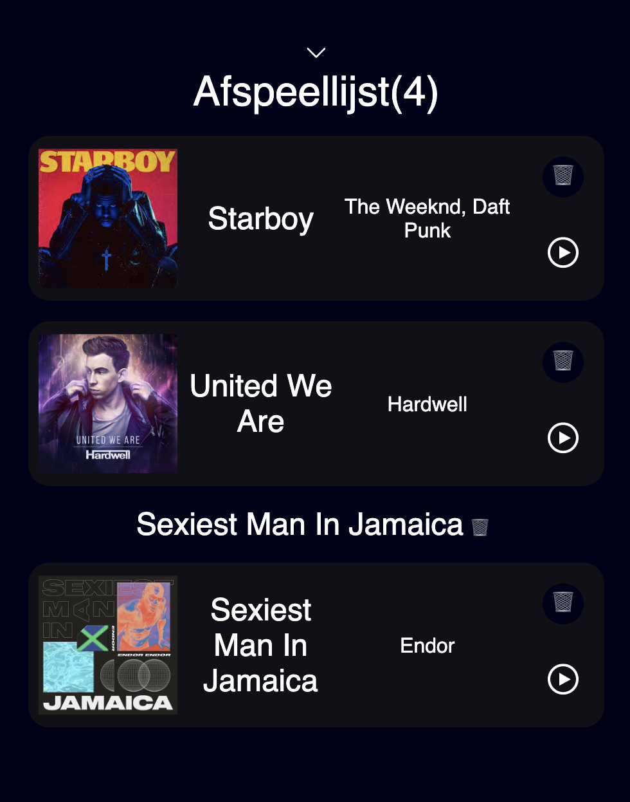
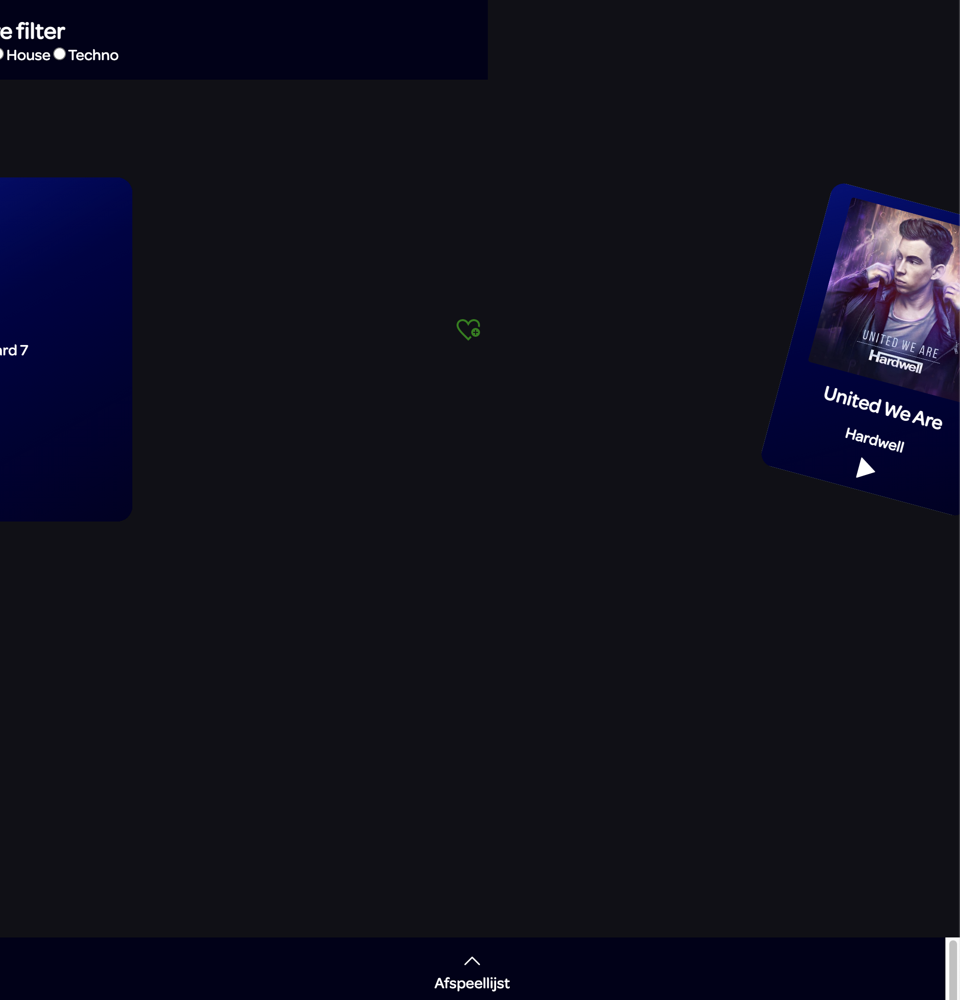
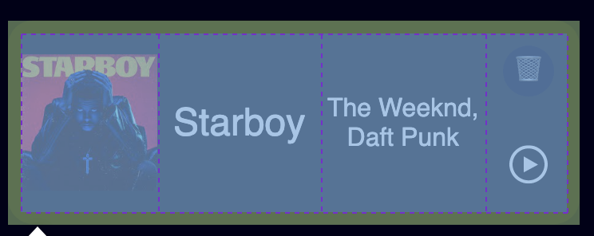
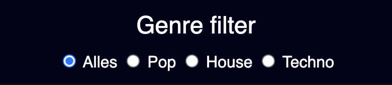
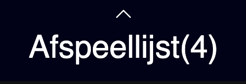

# Procesverslag
**Auteur:** Rens Westerveld

**De opdrachten:** [opdracht 1](opdracht1/index.html) en [opdracht 2](opdracht2/index.html)

Markdown is een simpele manier om HTML te schrijven.  
Markdown cheat cheet: [Hulp bij het schrijven van Markdown](https://github.com/adam-p/markdown-here/wiki/Markdown-Cheatsheet).

Nb. De standaardstructuur en de spartaanse opmaak van de README.md zijn helemaal prima. Het gaat om de inhoud van je procesverslag. Besteedt de tijd voor pracht en praal aan je website.

Nb. Door *open* toe te voegen aan een *details* element kun je deze standaard open zetten. Fijn om dat steeds voor de relevante stuk(ken) te doen.

## Bronnenlijst
  1. https://developer.mozilla.org/en-US/docs/Web/CSS/clip-path
  2. https://developer.mozilla.org/en-US/docs/Web/CSS/mask-clip
  3. https://cssgradient.io/
  4. https://developer.mozilla.org/en-US/docs/Web/CSS/gradient/radial-gradient
  5. https://www.w3schools.com/cssref/css3_pr_animation.asp
  6. https://css-tricks.com/almanac/properties/a/animation/
  7. https://developer.mozilla.org/en-US/docs/Web/CSS/@media/prefers-reduced-motion
  8. https://iconmonstr.com/trash-can-10-svg/
  9. https://iconmonstr.com/favorite-10-svg/
  10. https://www.youtube.com/watch?v=jfYWwQrtzzY
  

## Opdracht 1 plan

  
Ik wil het logo van "De Nederlansche Bank" gaan animeren. Dit logo bestaant uit tekst met een soort cirkel door de tekst. Deze cirkel
  wil ik gaan animeren zodat het op een opengaande bankkluis lijkt. Wanneer de bankkluis open is zal de "e" veranderen in een euroteken die omhoog springt.

  ### Je storyboard:
  

  ### Je ambitie: 
  Aan deze technieken/punten wil ik werken:
  - Zelf kunnen maken van vormen in CSS.
  - Nieuwe "gecompliceerde" animatie technieken gaan gebruiken die ik nog niet ken.
  - De volledige animatie van mijn storyboard maken.
  - Perfect timen van animaties.
 

## Opdracht 1 reflectie

  
uitwerken bij afronden opdracht (voor week 3)

  ### Je uitkomst - karakteristiek screenshot(s):
  

  ### Dit ging goed/Heb ik geleerd: 
  Korte omschrijving met plaatje(s)

  Ik heb geleerd om een HTML element helemaal te stijlen met CSS. Zo heb ik van de h1 een cirkel gemaakt. (paars)
  Ik heb nu ook voor het eerst met clip-path gewerkt om zo een vorm te maken (driehoek). (rood)
  Ik begrijp nu positioneren beter (bijvoorbeeld de driekhoeken draaien en positioneren). (rood)

  

  ### Dit was lastig/Is niet gelukt:
  Korte omschrijving met plaatje(s)
  Ik vond het lastig om oplossingen voor specifieke dingen via internet te vinden.
  De toegankelijkheids ophoging voor "Verminder beweging" ging erg stroef. Hij wilde bij mij steeds niet werken om alles te pauzeren als standaard te hebben en
  pas af te spelen wanneer iemand geen voorkeur heeft. Andersom lukte het wel dus na hulp van Sanne/U is het mij toch gelukt. Het probleem zat hem in de selectie (werkte niet op de body, maar alleen op "*" en ik moest ::before en ::after er specifiek bij zetten) van de
  elementen en ik moest "!important" achter running zetten. 

  

## Opdracht 2 plan

  
uitwerken na schetsen idee (voor week 4)

  ### Je ontwerp:
  

  ### Je ambitie: 
  Aan deze technieken/punten wil ik werken:
  - Javascript leren
    - Muziek laten afspelen
    - Item toe laten voegen aan een lijst
  - Meer werken met grid

## Opdracht 2 test

  
uitwerken na testen (week 6/7)

  Neem minimaal 5 bevindingen op:

  ### Bevinding 1:
  Elke keer als ik 2 items toevoegde aan mij lijst versprong die ineens van plek. (tekst en afbeeding(en)
  

  #### oplossing:
  Ik heb de code helemaal opnieuw geschreven omdat er meerde fouten inzaten en toe werkte het wel.

  ### Bevinding 2:
  Als ik filterde dan veranderde de vormgeving van de muziekkaartjes (tekst en afbeeding(en)).
  

  #### oplossing:
  De vormgeving zat nog niet goed toegepast op alle kaartje. Omdat door het filteren de kaartjes een andere class kregen ging deze vormgeving niet mee.

  ### Bevinding 3:
  Wanneer ik een muziek kaart sleep vanaf de tekst, dan wordt de tekst toegevoegd aan de afspeellijst en niet het hele kaartje.
  

  #### oplossing:
  NOG NIET OPGELOST

  ### Bevinding 4:
  NOG BEDENKEN.
  

  #### oplossing:
  Beschrijving hoe je het hebt hebt opgelost of als het niet gelukt is hoe je het zou oplossen (tekst en afbeeding(en)).

  ### Bevinding 5:
  Wanneer ik een kaartje naar een van de kanten wilde slepen werd hij niet toegevoegd aan de afspeelijst, maar werd het beeld breder.
  

  #### oplossing:
  Ik heb de code helemaal opnieuw geschreven omdat er meerde fouten inzaten en toe werkte het wel. Ik heb de pagina anders ingedeeld en de HTML wat simpeler gemaakt.

## Opdracht 2 reflectie

  
uitwerken bij afronden opdracht (voor week 8)

  ### Je uitkomst - karakteristiek screenshot(s):
  

  ### Dit ging goed/Heb ik geleerd: 
  Korte omschrijving met plaatje(s)

  Ik heb echt veel Javascript geleerd. Ik weet nu hoe ik items van de ene UL naa de ander kan overzetten, Ik heb weer geoefend met een dropdown menu, Ik weet nu hoe ik
  items moet filteren. Ik heb nu ook beter leren werken met grids, want voorheen snapte ik alleen flexbox.
  
  
  

  ### Dit was lastig/Is niet gelukt:
  Korte omschrijving met plaatje(s)

  Het beginnen met javascript zonder voorbeelden of hulp ging erg lastig, maar door het voorbeeld van de tinderkaartjes heb ik erg veel geleerd en heb ik dit ook toe kunnen
  passen op mijn eigen ontwerp. Toen ik eenmaal een goede basis had liep het wel beter en kon ik specifieker kijken naar fouten die ik onderweg maakte.

  Het is mij door de tijd niet gelukt om ... te maken.
  

